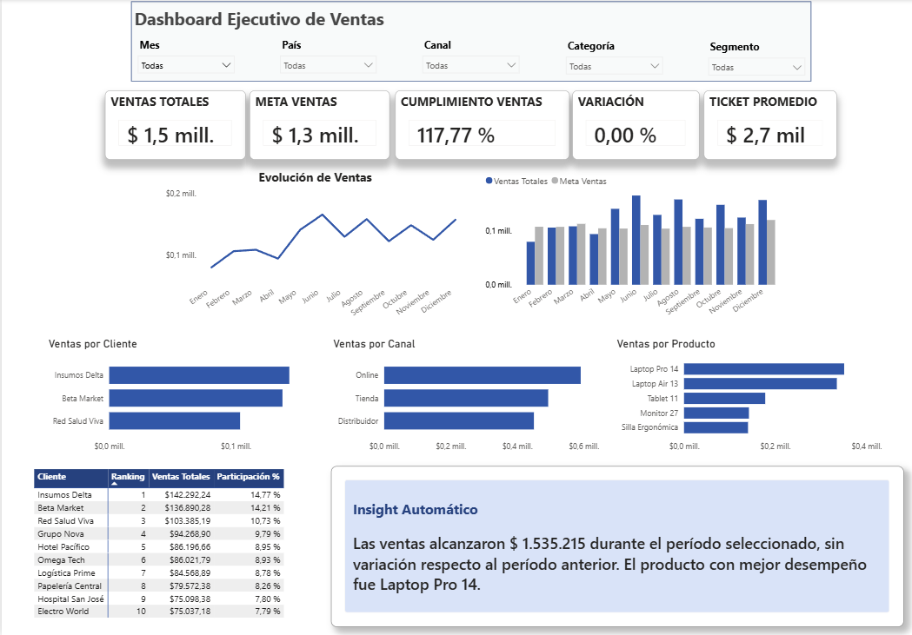
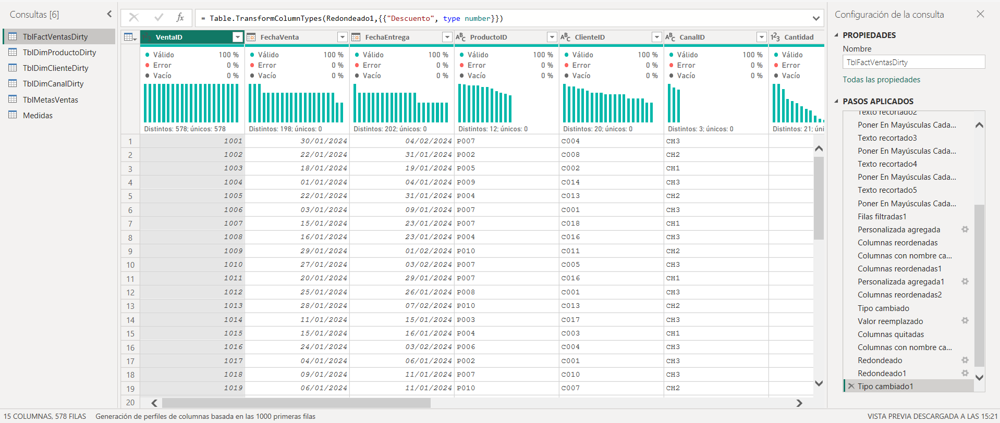
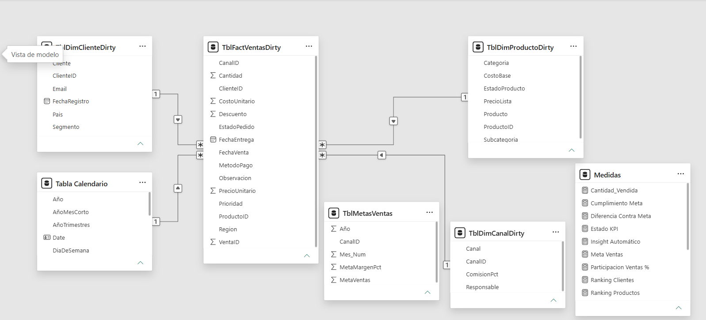

# 📊 Dashboard Ejecutivo de Ventas | Power BI

Proyecto de análisis de datos desarrollado en **Power BI** a partir de un conjunto de datos de ventas con errores e inconsistencias intencionales.

El proyecto abarca el flujo completo de análisis: **limpieza y transformación de datos con Power Query, modelado de datos, creación de medidas DAX y desarrollo de un dashboard ejecutivo interactivo**, orientado al análisis del desempeño comercial y la toma de decisiones.

 

## 🎯 Objetivo

Transformar datos de ventas sin procesar en información clara y útil para responder preguntas de negocio relacionadas con:

- Cumplimiento de metas de ventas.
- Evolución de las ventas en el tiempo.
- Productos con mejor desempeño.
- Clientes con mayor impacto.
- Participación de los distintos canales de venta.

 

## 🔄 Proceso de análisis

### 1. Limpieza y transformación de datos

Se utilizó **Power Query** para preparar y transformar las tablas antes de realizar el análisis.

Entre las principales tareas realizadas se encuentran:

- Limpieza y estandarización de textos y categorías.
- Corrección de formatos y tipos de datos.
- Tratamiento de valores nulos y registros inconsistentes.
- Validación de fechas y columnas numéricas.
- Preparación de las tablas para su posterior modelado.

### 2. Modelado de datos

Se construyó un **modelo de datos en estrella**, relacionando la tabla de ventas con las dimensiones correspondientes.

El modelo incluye:

- Tabla de hechos de ventas.
- Dimensión de clientes.
- Dimensión de productos.
- Dimensión de canales.
- Tabla calendario.
- Tabla de metas de ventas.
- Tabla dedicada a medidas.

### 3. Medidas DAX

Se desarrollaron medidas para analizar el desempeño comercial, incluyendo:

- Ventas totales.
- Cantidad vendida.
- Total de transacciones.
- Ticket promedio.
- Ventas del período anterior.
- Variación de ventas.
- Variación porcentual.
- Ventas acumuladas.
- Meta de ventas.
- Cumplimiento de meta.
- Rankings y participación.
- Insight automático dinámico.

 

## 📈 Dashboard ejecutivo

El dashboard permite analizar el desempeño del negocio mediante:

- KPIs de ventas, metas, cumplimiento, variación y ticket promedio.
- Evolución temporal de ventas y comparación contra metas.
- Análisis por cliente, producto y canal.
- Rankings y participación sobre las ventas.
- Segmentadores para realizar análisis dinámicos.
- Insight automático que se actualiza según los filtros seleccionados.

 

## 🛠️ Herramientas utilizadas

- **Power BI** — modelado, análisis y visualización de datos.
- **Power Query** — limpieza y transformación de datos.
- **DAX** — creación de medidas, KPIs y cálculos de negocio.
- **Microsoft Excel** — fuente de datos utilizada para el análisis.

 

## 🖼️ Vista del proyecto

### Dashboard Ejecutivo

Vista principal del dashboard con KPIs, análisis temporal, rankings, segmentadores e insight automático.

### Limpieza y transformación con Power Query

Proceso de preparación de los datos mediante consultas y pasos de transformación antes de construir el modelo.

### Modelo de datos

Modelo utilizado para relacionar la tabla de ventas con las dimensiones, calendario y metas necesarias para el análisis.

 

## 📁 Archivos del repositorio

- **Proyecto Avanzado PBI Rifai.pbix** — archivo principal del proyecto desarrollado en Power BI.
- **proyecto_powerbi_avanzado_dirty.xlsx** — dataset utilizado como fuente del análisis.
- **dashboard-ejecutivo.png** — vista del dashboard final.
- **power-query-limpieza.png** — vista del proceso de transformación.
- **modelo-datos.png** — vista del modelo de datos.

 

## ▶️ Cómo explorar el proyecto

1. Descargar el archivo `.pbix` disponible en este repositorio.
2. Abrirlo utilizando **Power BI Desktop**.
3. Explorar el dashboard y utilizar los segmentadores para analizar diferentes escenarios.
4. Consultar el modelo de datos, las transformaciones realizadas en Power Query y las medidas DAX desarrolladas.

> **Nota:** para visualizar y editar el archivo `.pbix` es necesario tener Power BI Desktop instalado.
